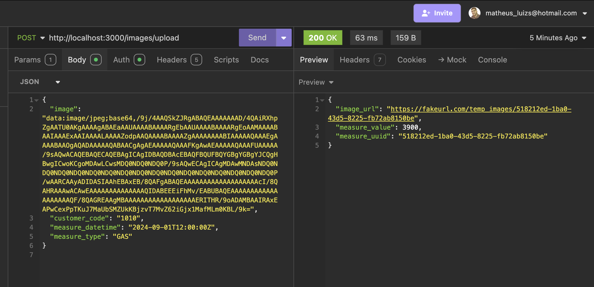
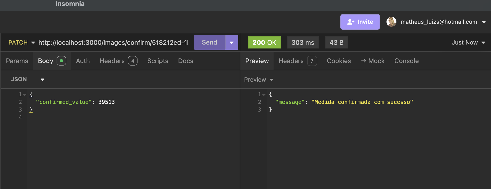
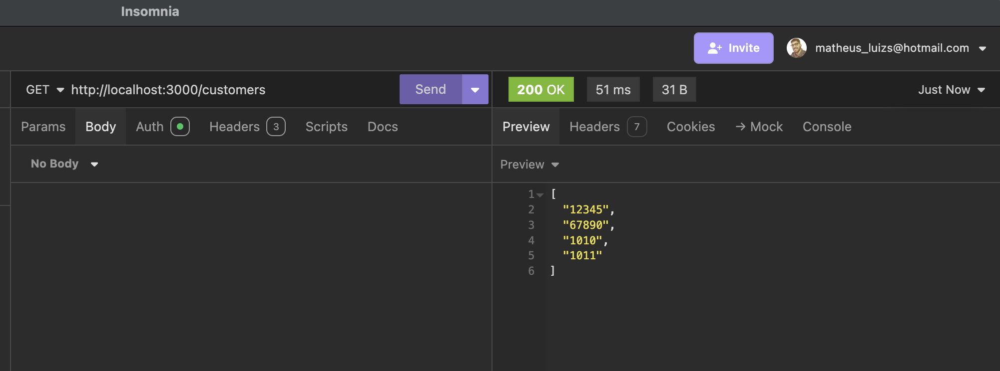
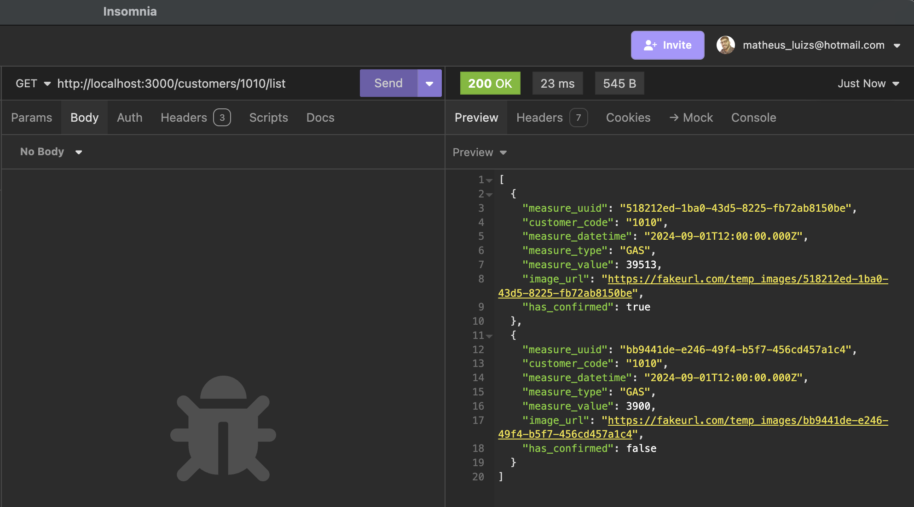

# Projeto Técnico Shopper 📷 ⌚ 

Este projeto consiste em uma API que automatiza a leitura de medidores de gás ou água a partir de fotos dos relógios medidores. Utilizando Node.js, Express, e TypeScript, a API recebe imagens desses medidores codificadas em base64, processa-as através de uma API de inteligência artificial (como o Google Gemini), e extrai o valor numérico exibido no medidor. Esses valores são então armazenados em um banco de dados MySQL, permitindo a consulta e confirmação das leituras. A integração com Docker facilita a configuração e execução do ambiente de desenvolvimento, enquanto o uso de Sequelize gerencia a persistência dos dados. O projeto resolve desafios como a manipulação e validação das imagens, garantindo uma automação eficaz para a leitura dos medidores.

# Tecnologias Utilizadas 🧰 💻

- **Node.js**: Plataforma de desenvolvimento back-end.
- **Express.js**: Framework web para Node.js.
- **TypeScript**: Superconjunto do JavaScript que adiciona tipos estáticos ao código.
- **Sequelize**: ORM para Node.js, utilizado para interagir com o banco de dados MySQL.
- **MySQL**: Sistema de gerenciamento de banco de dados relacional.
- **Axios**: Cliente HTTP para fazer requisições à API do Google Gemini.
- **Docker**: Plataforma para desenvolver, enviar e executar aplicações em containers.
- **Dotenv**: Utilizado para gerenciar variáveis de ambiente.

## Estrutura do Projeto 📁

```bash
├── src
│   ├── config
│   │   └── database.ts
│   ├── controllers
│   │   ├── confirmController.ts
│   │   ├── listController.ts
│   │   ├── uploadController.ts
│   ├── models
│   │   └── Measure.ts
│   ├── routes
│   │   ├── confirmRoute.ts
│   │   ├── listRoute.ts
│   │   ├── uploadRoute.ts
│   ├── services
│   │   ├── confirmService.ts
│   │   ├── customerService.ts
│   │   ├── geminiService.ts
│   │   ├── imageService.ts
│   │   ├── listService.ts
│   │   ├── uploadService.ts
│   ├── migrations
│   │   └── 20240902-create-measures.ts
│   ├── seeders
│   │   └── 20240902-measures-seeder.ts
│   └── index.ts
├── .env
├── docker-compose.yml
├── Dockerfile
└── tsconfig.json
```


## Variáveis de Ambiente

- O projeto utiliza um arquivo .env para gerenciar as variáveis de ambiente. As seguintes variáveis devem ser definidas:

```bash
DB_HOST=localhost
DB_USER=root
DB_PASSWORD=sua_senha
DB_NAME=shopper_db
DB_PORT=3306
GOOGLE_API_KEY=sua_chave_de_api_google
```


## Configuração e Execução do Projeto

## 1. Clonar o Repositório 👨‍👨‍👦‍👦
```bash
git clone https://github.com/seu-usuario/seu-repositorio.git
cd seu-repositorio
```
## 2. Instalar Dependências 📦
```bash
npm install
```
## 3. Configurar o Banco de Dados 🐬
Certifique-se de ter o MySQL instalado e rodando. Crie um banco de dados chamado shopper_db.

```sql
CREATE DATABASE shopper_db;
```
## 4. Executar as Migrações
```bash
npx sequelize-cli db:migrate
```
## 5. Rodar os Seeders 
```bash
npx sequelize-cli db:seed:all
```
## 6. Executar o Projeto 🏃
Para executar o projeto localmente:
```bash
npm run dev
```
### Dockerização 🐳
O projeto inclui um Dockerfile e docker-compose.yml para facilitar a execução em um ambiente Docker.

## 7. Executar com Docker 🐳
```bash
docker-compose up --build
```
## 8. Testar Endpoints 🧪 ✔️

- Use uma ferramenta como o Insomnia ou Postman para testar os endpoints:

 - Upload de imagem: POST http://localhost:3000/images/upload
 - Confirmar medida: PATCH http://localhost:3000/images/confirm/:measure_uuid
 - Listar todos os clientes: GET http://localhost:3000/customers
 - Listar as medidas de um cliente específico: http://localhost:3000/customers/:customer_code/list


## Simulação de API Google Gemini 🤖
Devido a limitações de quota durante o desenvolvimento, foi implementado um mock para simular o retorno da API Google Gemini nos arquivos uploadService.ts e geminiService.ts. Esse mock foi criado para testar o fluxo completo do projeto sem a dependência direta da API real, que estava gerando erros de "Too Many Requests".

Documentação técnica do Google Gemini (LLM): 🔐 🔑
 - https://ai.google.dev/gemini-api/docs/api-key
 - https://ai.google.dev/gemini-api/docs/vision


## Enviando imagem para leitura de medição 
 <div align="center">
    
</div>

## Confirmar leitura da medição realizada 
 <div align="center">
    
</div>

## Listar todas as leituras e clientes
 <div align="center">
    
</div>

## Listar as leituras de um cliente específico
 <div align="center">
    
</div>

